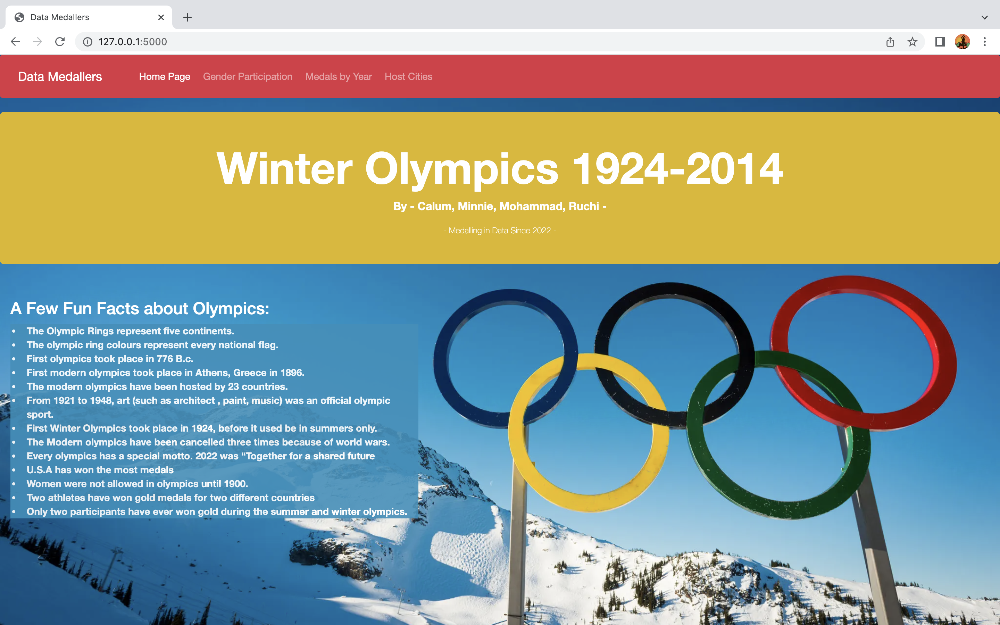
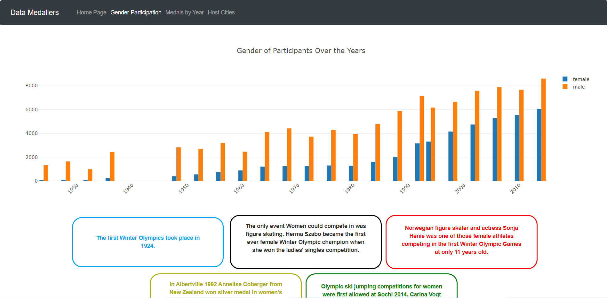
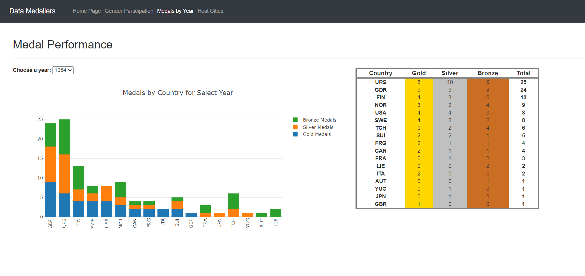
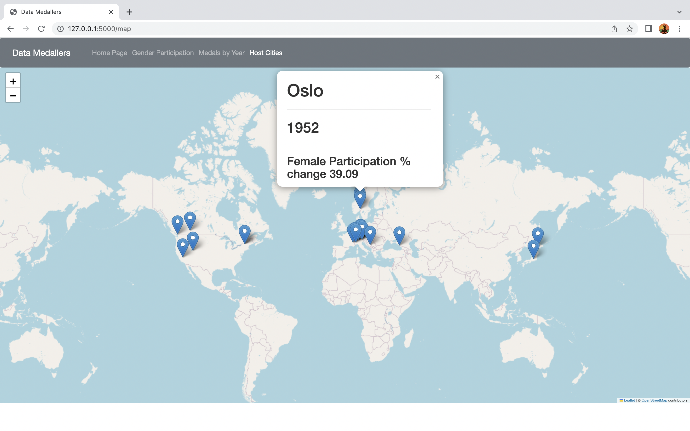

# Project3-Winter Olympics

Data Olympians(project contributors)
Calum, Ruchi, Minnie, Mohamed

Initial Project Proposal-

For the team project, the chosen theme that has been decided is data within Olympics. The time interval will be from the Athens Olympics Athens 1896 to Rio 2016. 
The dataset gives the result (Gold, Silver, Bronze) for each sporting event including all participating countries. The questions that we will attempt to answer are.

1) The medal count between the Male athlete’s vs the Women athletes
2) Are women better represented at the Summer or Winter Olympic games
3) Map to show which countries have hosted the Olympics and how female representation has grown over the years 

Initial proposal continued-

Kaggle -> CSV -> Python -> PostgreSQL -> Flask -> HTML,CSS,JS -> D3 -> Plotly -> Leaflet -> WEB

Questions Updated- 

Final Visualisations -

1) Men and Women Participation throughout the years through Plotly Bar graph. It Shows that women participation increased almost year from 1924 and the ration between men and women participation 

2) Medal Summary(Country wise medal count) of all the Olympic Games through dropdown button using Plotly stacked Bar Graph and table.

3) Pop up olympic venue cities from 1924 - 2014 on world map showing the change in women participation percentage from last year using leaflet. 1936 showed the maximum growth of 268 % in women participation while 1948, 1964, 1952 also had 64, 37, 39% high participation respectively.

Visualisations- 

